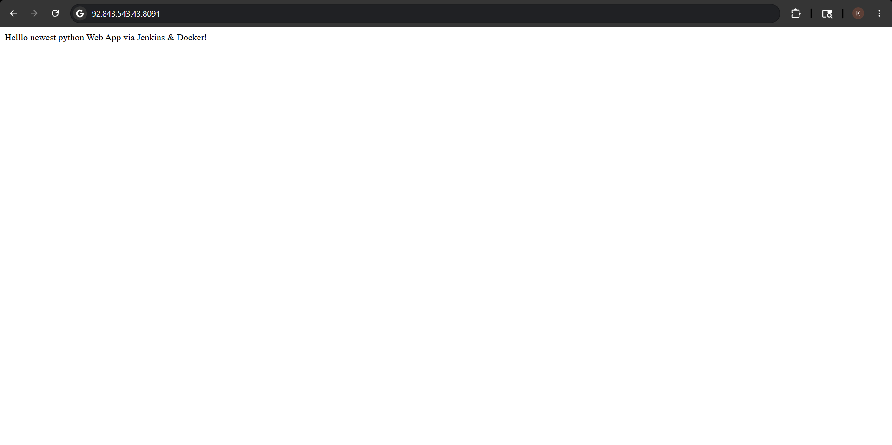
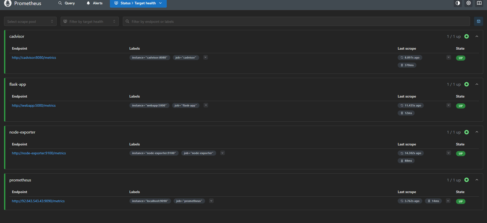
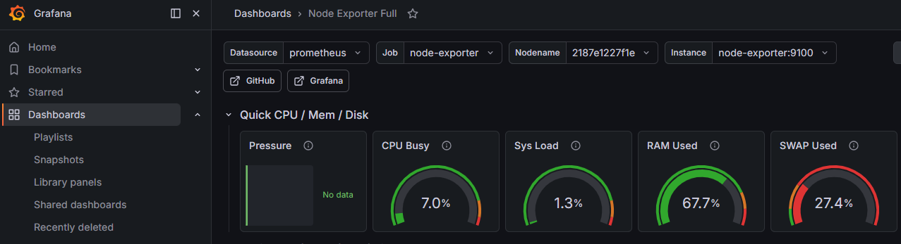

# CI/CD Monitoring Pipeline with Jenkins, Docker, Prometheus & Grafana

## Project Overview
This project demonstrates an end-to-end DevOps CI/CD and monitoring pipeline for a Python web application using Jenkins, Docker, Prometheus and Grafana. The pipeline automates code integration, quality checks, deployment and monitoring on AWS infrastructure.

## Tech Stack
- Jenkins
- Docker
- Python / Flask
- Prometheus
- Grafana
- AWS EC2
- SonarCloud

## Pipeline Workflow
1. Code pushed to GitHub
2. Jenkins pipeline triggered
3. SonarCloud code quality analysis
4. Docker image build
5. Deployment to AWS EC2
6. Monitoring using Prometheus and Grafana
7. Deployment verification

## Features
- Automated CI/CD pipeline
- Dockerized deployment
- Monitoring and observability
- Code quality checks
- Automated deployment verification

## Screenshots

### Application Running

### Prometheus Monitoring

### Grafana Dashboard

